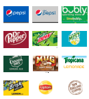
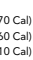

ALWAYS THE Real **DEAL**

# The Nines Menu

Click here to place an order or to see prices by location.

## Starters & Wings

### Boneless Wings Loaded Tots Seafood Stuffies Crispy Cauliflower

Cheddar tots smothered with caramelized onions, melted mozzarella and provolone cheeses and applewood smoked bacon. Baked until ooey & gooey then topped with creamy horseradish sauce and chives. (1330 Cal)
A New England favorite with a twist. Plenty of scallops, shrimp and delicious spices stuffed on a scallop shell. Oven baked and served with a fresh grilled lemon. (770 Cal)
Tempura style cauliflower lightly fried and served with spicy Sriracha ranch dipping sauce. (700 Cal)

### Double Bleu Iceberg Wedge House Salad Gs

A wedge of crisp lettuce smothered in creamy bleu cheese dressing. Topped with tomatoes, crumbled bleu cheese and applewood smoked bacon. (450 Cal)
Tomatoes, cucumbers, red onions, parmesan cheese and croutons. Please order without croutons if Gluten Sensitive. (110–450 Cal)
A hearty crock with hints of burgundy and plenty of onions. Topped with a crouton and melted Swiss, provolone and mozzarella cheeses. (360 Cal)

## Fresh Entrée Salads

 & Bowls

### Southwest Fajita Bowls Gs

Slow-Roasted Pork Carnitas GS Plain, without protein GS Seasoned Chicken GS Seasoned Shrimp Skewer GS 
(860 Cal)
(610 Cal) (760 Cal) (970 Cal)
South of the border style with sautéed onions and peppers, crisp romaine, corn, black beans, fresh pico de gallo, guacamole, jalapeños and steamed brown rice. Topped with fresh cilantro and chipotle sauce.

### Apple Cranberry Chicken Salad Gs Crispy Honey Mustard Chicken Salad

Fresh mixed greens with grilled chicken, green apples, cranberries, bleu cheese crumbles and sliced almonds. Served with creamy poppyseed dressing. (700 Cal)
Hand-breaded crispy chicken tenders on a bed of fresh mixed greens. Topped with applewood smoked bacon, Monterey Jack and cheddar cheeses, tomatoes, cucumbers and red onions. Finished with honey mustard dressing. Served with warm flatbread. (960 Cal)
GRILLED BALSAMIC CHICKEN GS
Tender lemon rosemary marinated chicken breast flame broiled with a balsamic glaze. Served with two sides. (440 Cal)

### Original Crispy Chicken Tenders

## Chicken

### Buffalo Chicken Mac & Cheese

Skillet baked creamy cavatappi Mac & Cheese topped with crispy handbreaded chicken tossed in our legendary Buffalo sauce, drizzled with Sriracha ranch sauce and topped with bleu cheese crumbles. Served with warm Rustic Bread. (1580 Cal) Also available with our Gold Fever or Honey BBQ sauce.

## Wraps, Sandwiches

Buttermilk-breaded boneless chicken breast and Maine Russet mashed potatoes with country gravy. Served with cranberry sauce, a warm honey-glazed biscuit and one side. (1240 Cal)
Toss in our signature Buffalo or Gold Fever sauce. Served with celery and bleu cheese.

### Country Fried Chicken

HONEY BBQ CHICKEN WRAP

Hand-breaded crispy chicken tenders with honey BBQ sauce. Wrapped up with lettuce, tomatoes, Monterey Jack and cheddar cheeses. Served with french fries or coleslaw. (850 Cal) 
Your choice of crispy or Southwest seasoned baked fish filet, fresh cabbage, fresh pico de gallo and chipotle sauce in warm flour tortillas with steamed brown rice. Served with guacamole, sour cream and a fresh lime. 

(1440–1470 Cal)

### Fish Tacos Crispy Cauliflower Tacos

## Juicy Burgers

Tempura style cauliflower, fresh cabbage, tomatoes, fresh pico de gallo and spicy Sriracha ranch sauce in warm flour tortillas with steamed brown rice. Served with guacamole, sour cream and a fresh lime. (1250 Cal)
Our tender and juicy beef burgers are seasoned, flame broiled to order and served on a brioche bun with all the fresh toppings. Served with french fries or coleslaw, unless otherwise noted. 

BACON & CHEESE BURGER* GS
Melted American cheese and applewood smoked bacon. Please order a Gluten Free roll and side if Gluten Sensitive. (870 Cal)
ALL STAR BURGER* GS
American cheese, applewood smoked bacon, sautéed onions, lettuce, tomato, pickles and our signature sauce. Served with french fries and coleslaw. Please order a Gluten Free roll and sides if Gluten Sensitive. (1850 Cal)
A tender, juicy 8 oz. Top Sirloin* paired with your choice of seafood and served with one side. 

### Seafood Trio

Tender shrimp, baked fish filet and sea scallops baked with seasoned cracker crumbs and butter. Paired with an 8 oz. Top Sirloin. (990 Cal)
BAKED STUFFED SHRIMP
Jumbo shrimp filled with seafood stuffing. Paired with an 8 oz. Top Sirloin. (980 Cal)
GRILLED SHRIMP SKEWERS
Delicious shrimp seasoned and grilled to perfection. Paired with an 8 oz. Top Sirloin. (710 Cal)

# Seafood

### Seafood Trio

Golden-fried, hand-breaded shrimp served with french fries, coleslaw and a tangy cocktail sauce. (1460 Cal)
Hand-breaded fish filets battered and fried until crispy. Served with tartar sauce, french fries and coleslaw. (1760 Cal)
BAKED STUFFED SHRIMP
Jumbo shrimp filled with seafood stuffing and baked to perfection. Served with two sides. (590 Cal)

### Roasted Salmon

North Atlantic salmon lightly seasoned and roasted. Served with two sides. Choose your style:
Simply Seasoned GS (670 Cal) Balsamic Glaze GS (700 Cal) Sweet Chili Sauce (770 Cal)

## Steak, Tips & More

Our signature Broiled Sirloin Tips smothered with fresh sautéed onions, peppers and mushrooms. Served with potato and vegetable. 

(730 Cal)
ST. LOUIS BBQ RIBS
Signature seasoned, falloff-the-bone ribs hickory smoked for hours and basted with BBQ sauce. 

Served with a warm honeyglazed biscuit, french fries and coleslaw. (2510 Cal)
BROILED SIRLOIN TIPS* GS
Our signature tips, hand cut and marinated with our secret 

### Sirloin Tips* & Chicken Tenders Top Sirloin Steak*

recipe. Served with potato and vegetable. (650 Cal)

### Pork Carnitas Mac & Cheese

Skillet baked creamy cavatappi Mac & Cheese spiked with jalapeño peppers and topped with slow-roasted pork carnitas and pico de gallo drizzled with chipotle sauce and fresh cilantro. Served with warm Rustic Bread. (1310 Cal)
Our signature Broiled Sirloin Tips paired with a handful of our Original Crispy Chicken Tenders. Served with french fries and honey BBQ sauce. (1530 Cal)
Tender and juicy. An 8 oz. top sirloin, cooked to your taste and dripping with flavor. Served with choice of two: potato, House Salad or vegetable. (310 Cal)

### Royal Sirloin* Gs

A flavorful, five-star, 12 oz. New York center cut. Expertly seasoned and flame broiled to perfection. Served with choice of two: potato, House Salad or vegetable. (620 Cal)
Add a cup of Broccoli & Cheddar Soup, Seafood Chowder or a House Salad and a Petite Treat™ Dessert.

Rice (310 Cal) - Coleslaw (150 Cal) - Corn (70 Cal) 
Maine Russet Mashed Potatoes GS (260 Cal)
French Fries (520 Cal) - Broccoli GS (25 Cal)
 Grilled Asparagus (25 Cal)

### Lemontito Martini

 Aperol Spritz Hendrick'S Gin & Tonic Mango Mai Tai

A classic! Hendrick's Gin infused with rose and cucumber is splashed with tonic and a freshly squeezed lime. (130 Cal)
Lawley's Small Batch Rum, Gosling's Black Seal Rum, Disaronno Amaretto, mango puree, pineapple juice and sour mix. (330 Cal)

# Margaritas

RED
IMPORTS
Corona Heineken WHITE
Cupcake Prosecco Sparkling Refreshers All-natural puree and soda water.

Strawberry Lemon 
(90 Cal)
Raspberry Lime 
(100 Cal)

## & Tacos

### 

DIET PEPSI_H1_4CP_SM_ (FOR USE .25" 1.5" )

PEPSI_H1_3PMS_LARGE (FOR USE 4" AND LARGER)

CMYK

CYAN 100 MAGENTA 42 YELLOW 0 BLACK 0

please use these values;
BAKED CHOCOLATE CHIP 

 COOKIE SKILLET

## Desserts

TOWERING MIDNIGHT FUDGE CAKE
Moist chocolate cake with Oreo® cookie crumbles baked inside. Served warm with creamy vanilla bean ice cream, hot fudge and whipped cream. (1520 Cal)
A warm and gooey New England classic. A fresh skillet-baked chocolate chip cookie topped with creamy vanilla bean ice cream and a drizzle of chocolate sauce. (1070 Cal)
PETITE TREATS™
They're the perfect size so there's always room for dessert. Selection varies so ask your server for today's selection. (270–660 Cal)
Items and prices may vary by location. Additional nutrition information available upon request. 2,000 calories a day is used for general nutrition advice, but calorie needs vary. Calorie counts for menu items do not include sides unless specific sides are listed. *Cooked to order. "Consuming raw or undercooked meats, poultry, seafood, shellfish or eggs may increase your risk of foodborne illness, especially if you have certain medical conditions." All weights are prior to cooking. To Go Orders are subject to up to a 4% packaging charge which is retained by Ninety Nine Restaurants for packaging costs and/or online services. The fee does not represent a tip or service charge for any employee. **Every effort has been made to ensure that the allergen information provided is accurate for those with gluten sensitivities. However, because of the handcrafted nature of our menu items, the variety of procedures used in our kitchens and our reliance on our suppliers, we can make no guarantees of its accuracy and disclaim liability for the use of this information. GS = Before placing your order, please inform your server if a person in your party has a gluten sensitivity.**

### Pork Carnitas Flatbread

Crisp flatbread glazed with queso and topped with slow-roasted pork carnitas, fire roasted corn, caramelized onions and Monterey Jack cheese. Finished with chopped cilantro and avocado ranch sauce. (680 Cal)
SIDE SALADS & SOUPS

### Broccoli & Cheddar Soup

Everyone's favorite! Creamy extra sharp cheddar cheese and broccoli. Crock (400 Cal) Cup (290 Cal) 
SEAFOOD CHOWDER
A favorite. Packed with clams, shrimp, schrod and potatoes. Crock (510 Cal) Cup (360 Cal)

### French Onion Soup Cheese Burger*

A classic, can't-go-wrong favorite with American, Vermont Cheddar or Swiss cheese. (750 Cal) 

### Smothered Tips* Gs

(270 Cal)

A crisp martini with Tito's Handmade Vodka and a splash of fresh lemon.

(230 Cal)
A refreshing, bubbly creation of Aperol and sparkling Cupcake Prosecco topped with a splash of soda water. 

(190 Cal)

### Fresh Fruit Sangria

Our handcrafted recipe blends Camila Malbec red wine and fruit juices. Served chilled over ice with fresh citrus and seasonal fruit. (330 Cal)

### Woodford Bourbon Sour Smash

PLATINUM MARGARITA
Patrón Silver 100% Agave Tequila, all-natural RIPE® ColdPressed Agave Margarita mix and fresh lime. (300 Cal)
HOUSE CUERVO MARGARITA
All-natural margarita mix, Jose Cuervo and a fresh squeeze of lime. (270 Cal)
Enjoy a frosty cold draft beer served in a 16 oz. chilled mug, our 23 oz. Blockbuster™ Mug or an ice-cold bottle. Our selection varies by restaurant. (65–364 Cal) 

### Crafts

Samuel Adams Wicked Hazy IPA Cisco Brewers Seasonal Samuel Adams Seasonal Samuel Adams Boston Lager Blue Moon Belgian White HORSESHOE ALE
Brewed exclusively for us by Harpoon Brewery.

Truly Hard SeltzerGS Angry Orchard Hard CiderGS
Just the Haze IPA (Non-Alcoholic)
O'Doul's (Non-Alcoholic)
A generous pour in a 7 oz. glass or enjoy a glass and a half in a Quartino. (122–273 Cal)
SPARKLING

# Surf & Turf Combos

### Baked Haddock

A favorite from the North Atlantic. Crusted with seasoned cracker crumbs and baked. Served with two sides. (590 Cal) 

## Sides

MUDSLIDE MARTINI
Kahlua, Bailey's Irish Cream and vodka with a drizzle of chocolate sauce. (240 Cal)
Lots of lime flavor! Sauza Hornitos 100% Agave Tequila, fresh lime and a splash of bubly Sparkling Water for a refreshing burst of lime.

(300 Cal)

# Cold Beer

DOMESTIC FAVORITES
BEER ALTERNATIVES
Firestone Pinot Noir EOS Merlot Kuleto Frog Prince Red Blend Camila Malbec Rickshaw Cabernet Sauvignon Frozen Lemonades All-natural and frosty. Raspberry Splash Strawberry Splash Classic Lemonade Fresh Brewed Lipton Iced Tea (6 Cal) New England Coffee (0 Cal)
Fountain Drinks (0–200 Cal) Strawberry Lemonade 
(160 Cal) 
Mango Iced Tea (130 Cal) 
Crispy buttermilk tabascobreaded chicken breast drizzled with spicy Sriracha ranch sauce stacked with lettuce, tomato and pickles. Served on a brioche bun with french fries or coleslaw. (820 Cal)
BONELESS WINGS & LOADED TOTS
Our signature hand-breaded Boneless Buffalo Wings paired with our irresistible Loaded Tots. (1230 Cal)
Hand-breaded and dripping with our signature spicy Buffalo or Gold Fever Sauce. (1150-1330 Cal)
XL Order **(1570-1850 Cal)**

### Mozzarella Moons

Mozzarella cheese lightly fried with a crispy, crunchy coating of parmesanseasoned breadcrumbs.

Served with classic tomato sauce. (860 Cal)

### Chicken Fajita Flatbread

Crisp flatbread glazed with queso and topped with fajita spiced grilled chicken, sautéed onions, peppers and Monterey Jack and cheddar cheeses. Finished with fresh pico de gallo, chopped cilantro and chipotle sauce. (820 Cal)

### Monstah Margarita

Muddled fresh fruit with Woodford Reserve Bourbon, Angostura bitters, 100%
organic agave syrup and RIPE® Cold-Pressed all-natural sour mix. (160 Cal)
A crispy hand-breaded classic. Served with honey mustard and two sides. (1080 Cal)

### Spicy Crispy Chicken Sandwich

VERMONT CHEDDAR BURGER*
Jam packed with the taste of New England. Vermont Cheddar cheese, caramelized onions, applewood smoked bacon and real Vermont maple mayonnaise. (960 Cal) 
Make it a 3-Way Combo and add a Seafood *Stuffie.*
Tender shrimp, baked fish filet and North Atlantic sea scallops baked with seasoned cracker crumbs and butter. Served with two sides and a fresh grilled lemon. (690 Cal)

### New England 

 Fried Shrimp Fish & Chips

EOS Moscato Ferrari-Carano Pinot Grigio Rickshaw Sauvignon Blanc Sebastiani Chardonnay Chalk Hill Chardonnay Acrobat Rosé Enjoy free refills on all except Frozen Lemonades.

## Wine

ROSÉ
Bud Light Budweiser Bud Select Michelob Ultra Miller Lite Coors Light ORDER NOW

### Make Any Entrée A

# Three Course Meal Cocktails
