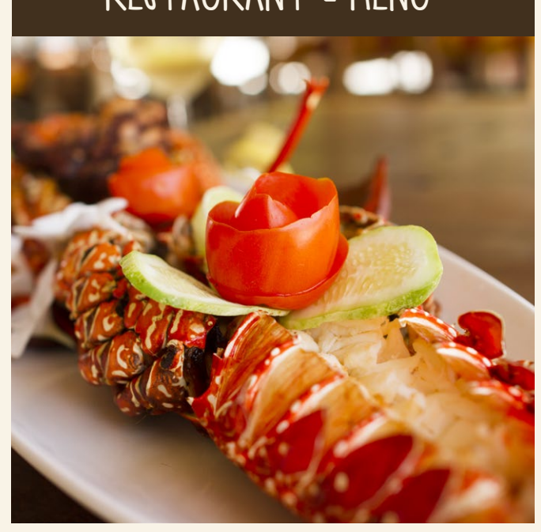

i RESTAURANT - MENU 

i

APPETIZER

6 $

SANDWICHES

9 $ 9 $ 9 $ 8 $
7 $
6 $ 6 $ 8 $ 5 $ 6 $ 6 $ 6 $ 6 $
8 $ 6 $
10 $
6 $ 8 $
7 $
9 $ 8 $
10 $

| CHEESE BURGER    |
|------------------|
| BEEF BURGER      |
| CHICKEN BURGER   |
| VEGETABLE BURGER |
| FISH BURGER      |

8 $

## Burger Sandwiches

* All served with french fries and fresh salad 10 $

| GUACAMOLE (Avocado, Lime, Olive Oil, Tomato, Green pepper, Onion)   |
|---------------------------------------------------------------------|
| BRUSCHETTA TOMATO AND MOZZARELLA                                    |
| BRUSCHETTA TOMATO, GARLIC AND OLIVES                                |
| MIXED BRUSCHETTA                                                    |
| GARLIC BREAD (Bread slices with garlic butter)                      |
| MINI PIZZAS ( Tomato and mozzarella cheese)                         |
| VEGETABLE SAMOSA                                                    |
| BEEF SAMOSA                                                         |
| KACHORI (Typical zanzibar potatoball with lime)                     |
| KATLESI (Typical zanzibar potatoball with beef)                     |
| SHRIMPS CANAPE' (Lettuce, shrimps, mayonnaise)                      |
| EGGS CANAPE' (Eggs, mayonnaise, mustard)                            |
| VEGETABLES\-TUNA CANAPE' (Mix fresh vegetables, mayonnaise, tuna)   |
| TOMATO CANAPE' (Baked tomato with mozzarella and garlic)            |
| MIXED CANAPE'                                                       |

| HOTDOG                                |
|---------------------------------------|
| CHICKEN SANDWICH                      |
| VEGETABLE SANDWICH                    |
| FRESH TUNA SANDWICH                   |
| TOMATO AND MOZZARELLA CHEESE SANDWICH |

| RUSSIAN SALAD (Boiled carrots, boiled potatoes, peas and mayonnaise)           | 8 $   |
|--------------------------------------------------------------------------------|-------|
| SHAMBA SALAD (Fresh mixed vegetables)                                          | 7 $   |
| SEAFOOD SALAD (Fresh fish on shamba salad in vinaigrette dressing)             | 12 $  |
| AVOCADO SALAD (Fresh garden salad with avocado and raisin in vinegar dressing) | 8 $   |
| CHICKEN S ALAD (Chicken fillet on fresh salad with mayonnaise)                 | 9 $   |
| TUNA CARPACCIO SALAD (Fresh raw tuna marinated in lime juice)                  | 10 $  |
| GREEK SALAD (Cucumber, tomato and black olives with feta cheese)               | 7 $   |
| CAPRESE SALAD (Fresh tomato slices, basil leaves and mozzarella)               | 8 $   |
| COKTAIL CALAMARI SALAD                                                         | 10 $  |
| OCTOPUS POTATOES SALAD (Boiled potatoes cubes with octopus)                    | 10 $  |

| EGGPLANT LASAGNA (eggplant, tomato, mozzarella and parmesan)   | 10$   |
|----------------------------------------------------------------|-------|
| GRATIN VEGETABLES (mixed roasted vegetables with bread crumb)  | 8 $   |
| FRIED VEGETABLE TEMPURA                                        | 10 $  |
| VEGETABLE CURRY                                                | 9 $   |
| PLAIN CHIPS (French Fries)                                     | 5 $   |

## Vegetarian Dishes

| GRILLED FISH OF THE DAY                         | 12 $   |
|-------------------------------------------------|--------|
| FISH FINGER (Breaded fish sticks)               | 12 $   |
| COCONUT CRUSTED CALAMARI RINGS                  | 10 $   |
| SEAFOOD CURRY                                   | 12 $   |
| CHICKEN PILIPILI                                | 10 $   |
| FRITTO MISTO (Mixed seafood tempura)            | 18 $   |
| BEEF OR CHICKEN COTOLETTA (Fried breaded steak) | 10 $   |
| AMERICAN PEPPER BEEF STEAK                      | 12 $   |
| BEEF SKEWERS                                    | 9 $    |
| CHICKEN SKEWERS                                 | 9 $    |
| SEAFOOD SKEWERS                                 | 12 $   |
| GRILLED JUMBO PRAWNS                            | 18 $   |
| OCTOPUS CURRY                                   | 12 $   |
| CHICKEN CURRY                                   | 10 $   |
| GRILLED LOBSTER                                 | 25 $   |
| GRILLED CIGALS                                  | 18 $   |
| "MIXED SEAFOOD PLATTER (For two pax)            | 40 $   |

*All served with rice and vegetable sauteè and sauce or french fries and mixed salad"

MAIN DISHES

| PLAIN PASTA (Olive Oil and Parmesan cheese)                              | 6 $   |
|--------------------------------------------------------------------------|-------|
| PASTA AL POMODORO (Tomato sauce)                                         | 8 $   |
| TUNA SPAGHETTI                                                           | 10 $  |
| VEGETABLE PASTA (Mixed vegetable sauce)                                  | 8 $   |
| PASTA BOLOGNESE (Minced beef Sauce)                                      | 9$    |
| SEAFOOD LINGUINE                                                         | 14 $  |
| PASTA PRAWNS AND ZUCCHINI                                                | 12 $  |
| PASTA AL PESTO (Basil, cashewnut and Parmesan sauce)                     | 9 $   |
| BEEF LASAGNA (Homemade lasagne)                                          | 12 $  |
| TUNA RAVIOLI (Homemade filled pasta)                                     | 12 $  |
| GNOCCHI AL POMODORO (Homemade Potatoes gnocchi in tomato sauce)          | 10 $  |
| STROZZAPRETI ALLE MELANZANE (Homemade special pasta in aubergine sauce)" | 10 $  |

PASTA

SOUPS

| PUMPKIN SOUP            | 8 $   |
|-------------------------|-------|
| POTATOES AND LEAKS SOUP | 8 $   |
| ZUCCHINI CREAM SOUP     | 8 $   |
| VEGETABLE CREAM SOUP    | 8 $   |
| COCONUT BROCCOLI SOUP   | 8 $   |
| CHICKPEAS SOUP          | 8 $   |

## Zanzibar Dishes

CASSAVA IN COCONUT SAUCE served with STEAMED FISH"
10 $ 10 $ 10 $
12 $
13 $
12 $ 12 $

7 $ 7 $
8 $
10 $
12 $
10 $ 10 $ 10 $
14 $

| FOCACCIA (Plain pizza with olive oil and rosemary)           |
|--------------------------------------------------------------|
| MARINARA (Tomato, garlic and olive oil)                      |
| MARGHERITA (Tomato and mozzarella)                           |
| HAWAII (Tomato, mozzarella, pineapple and chicken)           |
| TRE FORMAGGI (Tomato, mozzarella, cheddar, parmisan)         |
| QUATTRO STAGIONI (Tomato, mozzarella, sausage, green pepper) |
| VEGETABLE PIZZA (Tomato, mozzarella, mixed fresh vegetable)  |
| NAPOLI (Tomato, mozzarella, anchoives, cappers)              |
| SEAFOOD PIZZA (Tomato, mozzarella, mixed seafood)            |
| UJAMAA (Tomato, mozzarella, onion and tuna)                  |

| FISH BANANA IN COCONUT SAUCE                                      |
|-------------------------------------------------------------------|
| UGALI (Zanzibar polenta) served with FRIED FISH AND SPINACH SAUCE |
| "BEEF PILAU RICE (Spiced) served with KACHUMBALI SALAD            |
| BIRIANI RICE with BEEF or FISH                                    |
| CHAPATI served with FISH CURRY                                    |
| COCONUT RICE served with COCONUT FISH SAUCE                       |

10 $

SUSHI

| VEGETABLE SUSHI                           | 10 $   |
|-------------------------------------------|--------|
| TUNA SUSHI                                | 12 $   |
| SEAFOOD SUSHI (Octopus, Calamari, Prawns) | 14 $   |
| MANGO SUSHI                               | 10 $   |
| EGG SUSHI                                 | 12 $   |

12 $

PILAF RICE (Sauted rice with Curcuma and vegetable) CANTONESE RICE (Sauted rice with eggs and tuna) PLAIN RICE with sauce

| 10 $   |
|--------|

9 $
5 $

ROLL CHAPATI
10 $
CHICKEN ROLL CHAPATI VEGETABLE ROLL CHAPATI FISH ROLL CHAPATI
10 $
12 $

| 4 $   | 5 $   |
|-------|-------|
| 7 $   | 7 $   |

ICE CREAM (chocolate, mango, passionfruits, vanilla) FRUIT SALAD FRUIT SALAD WITH ICE CREAM (one ball) CAKE OF THE DAY (ask waiter)

COCKTAILS

| LADY GAGA MARACUYA (Passion fruit, orange juice, vodka)               | 8 $   |
|-----------------------------------------------------------------------|-------|
| LADY GAGA BANANA (Banana fruit, pineapple juice, vodka)               | 8 $   |
| LADY GAGA PINEAPPLE (Pineapple frui and juice, banana fruit, vodka)   | 8 $   |
| KARIBU ZANZIBAR (Campari, triple sec, lime, orange juice, ice)        | 8 $   |
| PINACOLADA (Malibu, White Bacardi, pineapple juice,coconut milk, ice) | 8 $   |
| UJAMAA TONIC (Gin, konyagi, lime, tonic soda, ice)                    | 8 $   |
| CUBALIBRE (Jamaica Rum, Cocacola, lime, ice)                          | 8 $   |
| POLE POLE (Malibu, Vanilla vodka, pineapple juice, ice)               | 8 $   |
| MOJITO (Fresh mint leaf, White bacardi, lime, sugar, crushed ice)     | 8 $   |
| HAKUNA MATATA (Amarula, Afrikoko, Banana, Coconut milk, ice)          | 8 $   |
| SEX ON THE BAR (Baileys, dark bacardi, Banana, coconut milk, ice)     | 8 $   |
| LALA SALAMA (Brandy, vodka, pineapple juice, orange juice, ice)       | 8 $   |
| BLUE LAGOON (Blue curassao, vodka, lime, ice)                         | 8 $   |
| TEQUILA SUNRISE (Tequila, grenadine, orange juice, ice)               | 8 $   |
| "MANGO COLADA (Amarula,coffee liqueur, mango juice,coconut milk ice)  | 8 $   |
| PROMISE AFRICA (Vodka, water melon juice, ice)                        | 8 $   |
| BROWN SKIN (Konyagi, honey, lime, passion juice, ice)                 | 8 $   |
| CAIPIRINHA (Cachaca, lime, sugar, crushed ice)                        | 8 $   |
| ORANGE BLOSSOM (Gin, honey, orange juice, ice)                        | 8 $   |
| MARGARITA (Tequila, triple sec, lime, ice)                            | 8 $   |
| DAIQUIRI FROZEN (rum, ginger, crushed ice and your choice of fruit)   | 8 $   |
| SPRITZ (Prosecco, sparklin water, orange, ice, aperol)                | 8 $   |
| SUPER GIN (Gin, vodka, fresh ginger, lime, crushed ice)               | 8 $   |
| DAWA (Konyagi, honey, lime, crushed ice)                              | 8 $   |
| GIN TONIC SINGLE                                                      | 5 $   |
| GIN TONIC DOUBLE                                                      | 8 $   |

To ensure the quality and goodness of our recipes we have chosen to use 

only fresh and seasonal products.

With the true rhythm of life our cooks transform these gifts of nature, with respect and delicacy, 

giving shape and flavor to delicious dishes.

Following this philosophy we can spend a few more minutes preparing the dishes but

you could take advantage of being together and sharing the emotions of your vacation.

Our food is made with love.

| MINERAL WATER 1,5 LT                                                                                 | 1,5 $   |
|------------------------------------------------------------------------------------------------------|---------|
| MINERAL WATER 0,5 LT                                                                                 | 1 $     |
| SODA (Coca cola, Fanta, Sprite, coca light, soda water, tonic water, bitter lemon, Stoney tangawizi) | 2 $     |
| REDBULL                                                                                              | 3 $     |
| FRESH FRUIT JUICE (Ask for fruits of the day)                                                        | 3 $     |
| FRESH COCONUT JUICE                                                                                  | 3 $     |
| SMOOTHIES (Ask for flavour of the day)                                                               | 4 $     |
| CHOCOLATE MILKSHAKES                                                                                 | 4 $     |
| FRUITS MILKSHAKES (Ask for fruits of the day)                                                        | 4 $     |
| BEERS (Safari, Kilimanjaro, Tusker, Ndovu, Castle, Heineken, Serengeti)                              | 3 $     |
| SAVANNA                                                                                              | 4 $     |

| ESPRESSO                                                 | 2 $   |
|----------------------------------------------------------|-------|
| MACCHIATO (Espresso with milk foam)                      | 2,5 $ |
| CAPUCCINO                                                | 3,5 $ |
| AMERICANO (Long Coffee)                                  | 2,5 $ |
| ICE COFFEE (Shaken Espresso with Ice)                    | 4 $   |
| UJAMAA COFFEE (Espresso with milk foam and whisky cream) | 5 $   |

| To ensure the quality and goodness of our recipes we have chosen to use                            |
|----------------------------------------------------------------------------------------------------|
| only fresh and seasonal products.                                                                  |
| With the true rhythm of life our cooks transform these gifts of nature, with respect and delicacy, |
| giving shape and flavor to delicious dishes.                                                       |
| Following this philosophy we can spend a few more minutes preparing the dishes but                 |
| you could take advantage of being together and sharing the emotions of your vacation.              |

COFFEE

AFRICAN HUMAN RHYTHM
Our food is made with love.