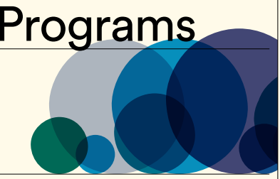
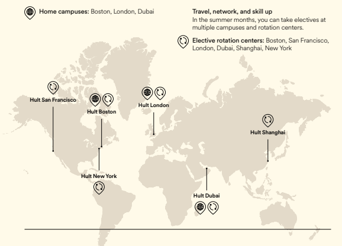
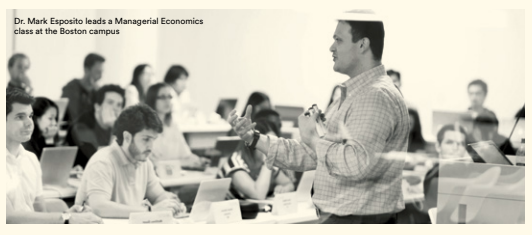
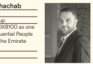

TWO Y
EARS 
ON-CA
MPUS &
 HYBRI D OPTI
ONS 
MULTI
PLE LO
CATION
Hult International Business School Part-Time S 
 Global

 MBA 

2022 Program Catalog Executive MBA Hybrid MBA
Programs for experienced working professionals HULT.E

 DU/EM
BA
BOSTON | LONDON | DUBAI

# Flexible Mbas 

 For Those Made To Do

You want an MBA that will give you a competitive edge in the rapidly changing global economy and future-proof your career. Hult's MBA program has been designed to develop the skills most in demand in businesses worldwide so you can make an impact—in both corporate and entrepreneurial environments. You'll graduate with the practical leadership skills, applicable knowledge, and effective mindsets to transform your life and career. 

#### Be The Best Leader You Can Be

It's not until you actually lead a team of people that you understand the type of leader you are. We've taken advanced self-awareness practices from leadership development courses and built them into all our degree programs. Armed with this insight and the systematic feedback of your peers, you'll work to improve the key skills you've identified and develop an authentic style of leadership that's uniquely you. 

#### Gain The Digital Skills The 21St Century Demands

Different specializations require different technological savvy but one thing's for certain—you need a strong digital skillset in today's workplace. Choose from a variety of specializations that will give you the knowledge and skills to succeed in a tech-driven business world. 

#### Make Personal Career Connections

We work with every student individually to set a targeted career strategy and guide them on a clear path to achieve their career ambitions. With insider knowledge, local expertise, and years of experience on the job, our coaches work with you one-on-one, from day one. Make the most of the opportunity to connect with professionals across multiple locations and industries and you'll be in the strongest possible position come graduation.

# Built In Flexibility For Working Professionals

When you add graduate study to an already busy life, flexibility is a must. Hult's part-time MBA programs are designed to help you balance your studies with your other commitments. The degree adapts to your needs and is flexible enough to change if your life does. 

Flexible start dates We have two intakes throughout the year, so you can start the program when it suits you best. Weekend classes Classes take place over one long weekend per month, meaning minimal disruption to your work life. 

Mode of study Our Executive MBA offers up to 100% on-campus classes with options available for online study, if needed.* Our Hybrid MBA caters for 50% 
on-campus classes and 50% online study.

Never fall behind If you miss a class for any reason, you can simply catch up at another time, or even at another campus.** 
Change campuses In the summer months, customize your degree with electives at any of Hult's campus locations and, in special circumstances, change your home campus.

Go at your own pace Students typically complete the program in two years but you can pause the program and take up to four years to finish. 

*While Hult offers EMBA students the option to take core courses in an online format, this is to be used only as an alternative option for occasional circumstances when in-person attendance cannot be arranged. 

**Subject to class availability and capacity.

# Your Part-Time Mba At A Glance

With our uniquely global MBA degree, you'll study every topic through a global lens, master working in cross-cultural teams, and learn to lead in a complex international business environment.

#### Executive Mba

Integrate study into your busy working life with on-campus classes over one long weekend per month Part-time (two years) 100% on campus, online options available if needed 85,000 USD* (Boston) 57,800 GBP* (London) 314,000 AED* (Dubai)

#### Hybrid Mba

Get the best of both worlds with our vibrant campus environment and the flexibility of learning from home Part-time (two years) 50% on campus, 50% online 57,750 USD* (Boston, US time zone) 
37,200 GBP* (London, UK time zone) 
195,000 AED* (Dubai, Dubai time zone) 

#### Year 1

Core Program Core Challenges You'll study your core courses gaining a comprehensive understanding of your chosen subject area while building your leadership skills through practical, hands-on learning Work in diverse teams to solve real-world business challenges and gain the practical skills you need for the global workplace In the summer months, customize your degree with a wide range of electives oered at all Hult campus locations

#### Year 2

Core Program In your second year, you'll continue to expand your expertise with core courses Core Challenges Continue to develop your practical skills with real-world business challenges Electives Take your nal electives in the summer months of your second year Home campus Elective rotation centers IMMEDIATE IMPACT LEARNING: We have identied the skills most needed in business today and built the development of these skills into your program, so you apply your learning in real-time with immediate impact.

*This is indicative program pricing, other fees will apply. 

Please visit our website for more detailed costs.

Electives Home campus Elective rotation centers

# Your Part-Time Mba Curriculum

| Module         | Module description                    | Courses covered           | Challenge                |
|----------------|---------------------------------------|---------------------------|--------------------------|
| theme          |                                       | in module                 |                          |
| Module 1:      | Launching a new product:              | Authentic Leadership 1:   | Business Challenge #1    |
| Design         | From the go\-to\-market strategy      | Leadership Journey        | - New Venture Strategy   |
|                | and financials to authentic           | Marketing Strategy        | - Simulation             |
|                | leadership, this module will give     | Financial Statement       |                          |
|                | you the tools and hands\-on           | Analysis                  |                          |
|                | experience you'll need to             |                           |                          |
|                | successfully launch a new product.    |                           |                          |
| Module 2:      | Practice relationship\-building and   | Authentic Leadership 2:   | Business Challenge #2:   |
| Sales          | communications skills, along with     | Managing Relationships    | - Building Your Sales    |
|                | data analysis and sales strategy.     | Business Insights         | Strategy & Pipeline in   |
|                | Learn to create and implement         | Through Data              | Two Countries            |
|                | successful sales programs.            | Building a Sales Strategy | - Pitch Competition      |
| Module 3:      | Manage global operations by           | Authentic Leadership 3:   | Business Challenge #3:   |
| Delivery       | deepening your understanding of       | Personal Influence        | - International Supply   |
|                | information systems, managing         | Data Management           | Chain—Sustainability     |
|                | supply chains, and embodying          | Operations                | Focus                    |
|                | ethics & sustainability—all the       |                           |                          |
|                | while continuing to work on your      |                           |                          |
|                | leadership skills and team            |                           |                          |
|                | collaboration.                        |                           |                          |
| Module 4:      | Identify business opportunities,      | Authentic Leadership 4:   | Business Challenge #4:   |
| Growth         | create a project plan, assess         | Moral Perspective         | - New Market             |
|                | financial viability, and persuasively | Data Visualization &      | Expansion Plan For a     |
|                | present a plan to profitably expand   | Storytelling              | Real Client              |
|                | into new markets.                     | Financial Decision                           |                          |
|                |                                       | Making & Budgeting        |                          |
|                |                                       | Project Management        |                          |
| Module 5:      | The only constant in life, and        | Authentic Leadership 5:   | Capstone Challenge       |
| Transformation | business, is change. Your final       | Leading Change            | - Digital Transformation |
|                | module addresses harnessing           | Strategy                  | & Consulting             |
|                | new technologies to lead your         | Digital Transformation    |                          |
|                | organization's digital transformation |                           |                          |
|                | projects.                             |                           |                          |

# Which Electives Will

## You Choose?

You'll take electives during the summer months based on your personal interests and professional goals. New electives are added every year to keep options fresh and relevant, and over 150 electives are available to study every summer. If you want to specialize in a particular area, you'll need to concentrate your choices within that field. Different campuses offer different electives, and they are delivered in a variety of formatsso it's up to you where, what, and how you study. 

#### Sample Electives

Management & Leadership Crisis Management, Mitigation & Response Gender Intelligence International Negotiations Management Psychology Managerial Coaching Skills Organizational Performance, Business, Behavior 
& Diversity

#### Innovation

Developing the Next Growth Engine Disruption Futures Disruptive Business Models Leading and Thriving in the Digital Era Social Innovation

#### Entrepreneurship

Entrepreneurial Finance Family Business Entrepreneurial Marketing Design Thinking New Product Innovation eCommerce Development

#### Finance

Blockchain, Cryptoassets & Cryptocurrencies Business Law & Ethics in Practice Corporate Finance Fintech Global Strategic Valuation

| Investment Banking     |
|------------------------|
| Mergers & Acquisitions |
| Private Equity         |

#### Add More Skills And Experience To Your Resume

Our Executive MBA candidates are eligible for a free Unlimited Electives Package worth 20,000 USD. 

#### What'S Included In The Package?

- Upgrade from the standard five Executive MBA 
electives to unlimited electives over the course of your two-year program.

- Expand your knowledge and expertise in highly desirable topics with unlimited electives across a range of more than 180 courses including business analytics, disruptive technology, innovation, and behavioral science.

#### Business Analytics

Behavioral Economics & Decision Making Business Intelligence Data Strategy Data Visualization Introduction to Python Introduction to R
Marketing Analytics Supply Chain Analytics

#### Marketing

Customer Acquisition Through Digital Marketing Customer Relationship Management with Salesforce Digital Marketing Strategy Introduction to Product Management Luxury Marketing Neuromarketing Psychology of Pricing Sales Strategies Strategic Brand Management Sustainable Brands & Marketing Project Management Agile Project Management Project Procurement Project Planning & Execution
- Travel to as many campuses as you like for electives during your summer semesters and build a global network as you gain on-the-ground international experience in Boston, San Francisco, London, Dubai, Shanghai, and New York. Online alternatives are also available for selected courses.

### Learning From The Experts Never Stops

# Expert Career Coaching

Your knowledge, skills, and qualifications will need to be constantly updated throughout your career. Once you graduate, we have lifelong learning options that enable you to stay up to date and relevant—always. 

#### An Elective A Year For Life

Your guess is as good as ours when it comes to what skills you'll need in five, ten, or fifty years from now. 

What we can promise is that you can come back to any campus, every year, to take an elective that suits you.*

#### Passionate Professors From The Real Business World

More than just professors, our practitioner faculty are supportive mentors that have your professional goals in mind. Known as much for their academic credentials as for their decades of experience as executives, consultants, and entrepreneurs, our faculty members know what it takes to thrive in the demanding world of international business. 

We're proud to have United Nations and government advisors on sustainability issues, financial experts who work with the IMF and World Economic Forum, founders of global brands such as The North Face, and many successful authors and renowned speakers as part of our faculty. Visit hult.edu/faculty for professor profiles.

*Courses are subject to availability and a 100 USD registration fee, subject to change. Some courses are offered online. 

At Hult, you'll collaborate with career coaches to reflect on your strengths, values, and vision for the future. You'll accelerate your career journey with an individualized plan to make sure your time and energy are used most effectively. Your career coaches will equip you with the skills to drive you forward and build the professional reputation you deserve.

#### Personal Career Advising

You can set up personalized career advising with our expert coaches. They're experienced in coaching executives, and can help you create a targeted career progression plan. Even after you graduate, you can make use of these sessions for up to three months post-graduation.

#### Skills Workshops

Attend online and on-campus workshops on essential topics including perfecting your digital brand, mastering in-person and virtual interviews, and developing efficient networking and relationshipbuilding skills.

#### Invaluable Connections

You'll make personal and professional connections with ambitious executives, successful alumni, internationally renowned professors, and business leaders from all over the world. 

Selina Neri, PhD
Italian Coach Dean, Hult Dubai With over 26 years of 

international corporate experience, Selina specializes in helping executives build gravitas and accelerate career progression. She is a globally recognized career champion who guides professionals to map out and land their next big thing and develop deep, authentic bonds with fellow professionals.

Mohamad Khachab

Lebanese CEO, BMB Group Named on the DXB100 as one of the Most Influential People Helping Shape the Emirate 
(2018)
Class of 2017
"The caliber of my classmates exceeded my expectations, as did the diversity of the professors, who come from all over the world with proven practical experience."

# Fund Your Future

Your education is undoubtedly one of the most important investments you will ever make. Throughout the application process, we will work closely with you to help you understand the options available to you to finance your degree.

#### Partial Scholarships

Partial scholarships are designed to help us find the best global talent and maximize diversity. Our scholarships cover a wide range of backgrounds, industries, sectors, and nationalities. - Social Impact Scholarship - Global Professional Scholarship
- Entrepreneurial Impact Scholarship
- Women in Business Scholarship - Senior Leader Scholarship

Please note: Needs-based financial aid and scholarships are only available to students in the on-campus EMBA program.

#### Needs-Based Financial Aid

If you have a demonstrated financial need, Hult may be able to help with limited needs-based financial aid that is awarded on a case-by-case basis. The financial aid committee looks at the situation of each accepted student and, depending on each candidate's personal circumstances, decides if financial aid will be awarded and at what level.

#### Asking Your Company To Help Fund Your Part-Time Mba

Your part-time MBA also brings huge benefits to your organization. Having your employer invest in your business education is a mutually beneficial way to fund your program. Many part-time MBA students choose to focus on their employing company for their class assignments. All of this can be immediately applied in the workplace as well as to your own professional growth. Find out more about our Corporate Partner Program: 
hult.edu/corporate

#### Loans & Government Support

Financial institutions in many countries offer education financing specifically to local citizens. These loans are typically repayable after completion of the course, although terms vary widely. Depending on where you are from, you may be eligible for loan and grant opportunities offered by your government.

# Ready To Apply?

If you're made to do, then chances are, you're made for Hult. We assess candidates individually based on the strength of their whole profile and take the time to get to know your unique value and skillset.

#### Entry Requirements

- Bachelor's degree or equivalent* - Three or more years' post-graduate work experience 
- Proficiency in English (TOEFL/IELTS/PTE)**

#### How To Apply

1. Complete your online application at hult.edu/apply 2. Pay the 75 USD application fee 3. Submit application and supporting documents
- Resumé/CV - Personal statement
- University transcripts 4. Personal assessment interview (see below) 5. Admissions decision 6. Submit deposit to confirm your seat Your personal assessment 

#### Interview

This interview is the centerpiece of the Hult admissions process. We are a futurefocused business school and this is the best opportunity you have to share your plans and dreams with us! This interaction gives us an exciting opportunity to get to know you and for you to get to know us.

How it's done: In person or video call
*Applicants without a bachelor's degree but with over 10 years of relevant work experience will be considered. 

**English test waivers may apply for native English speakers or if your bachelor's was completed in an English-speaking country or you have worked for over two years with English as your daily business language. Your English test results can come later in the process if they're not available immediately.

# Hult.Edu/Emba

FOR FULL DETAILS ON THE PROGRAMS INCLUDING:

CURRICULUM AND CAMPUSES, COSTS AND SCHOLARSHIPS, ADMISSIONS AND APPLICATION